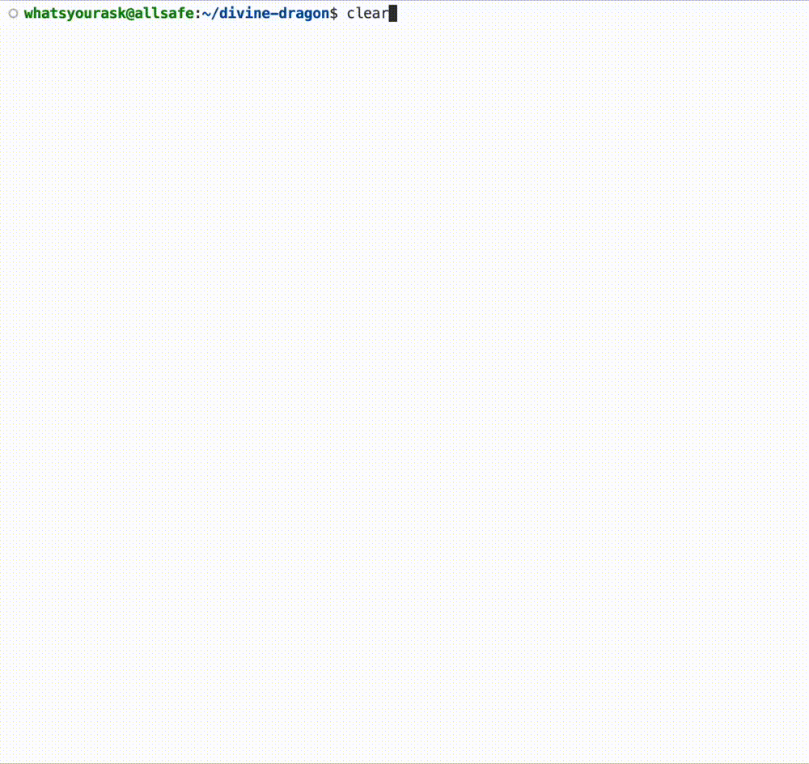
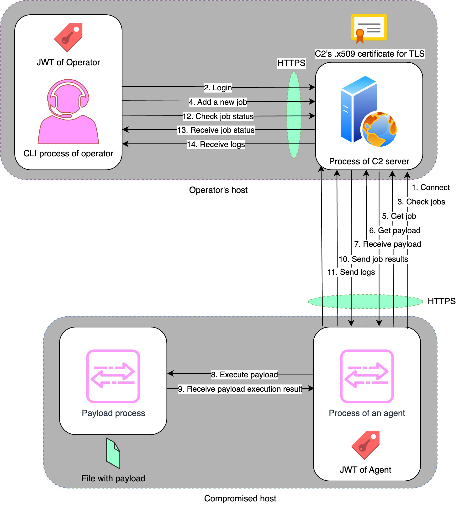
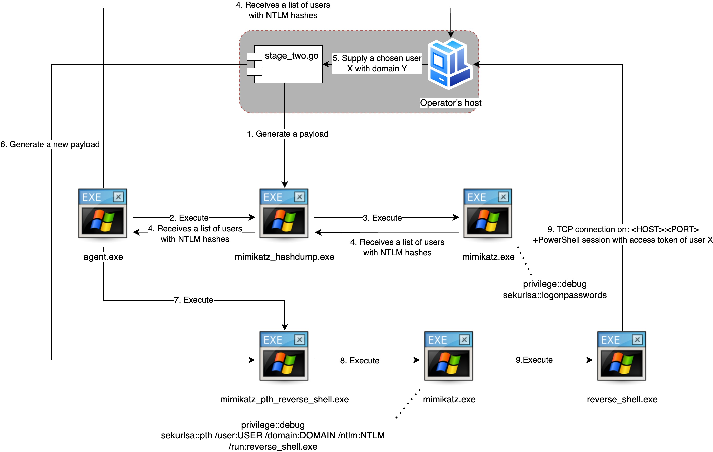
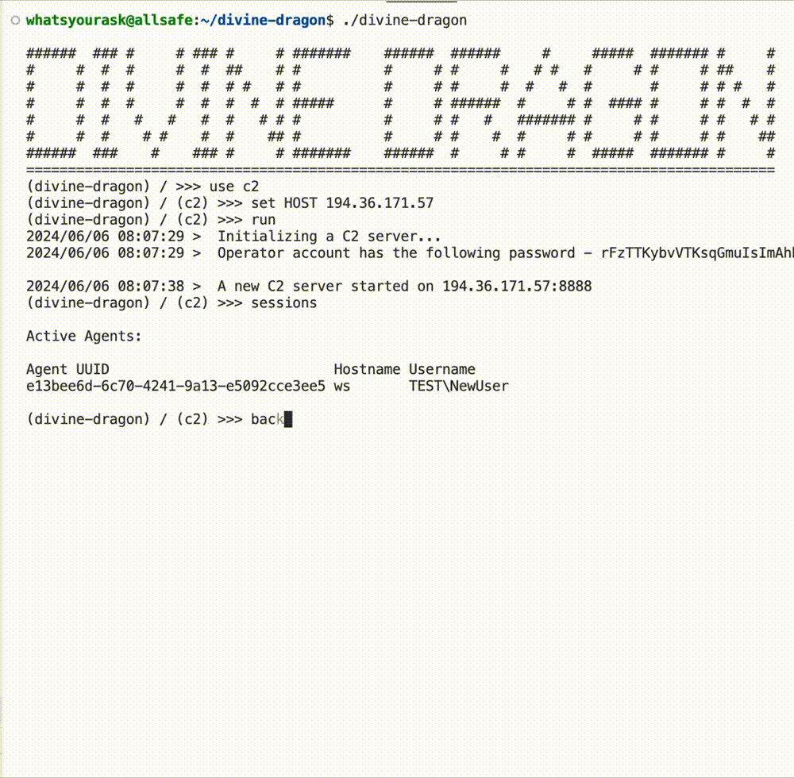
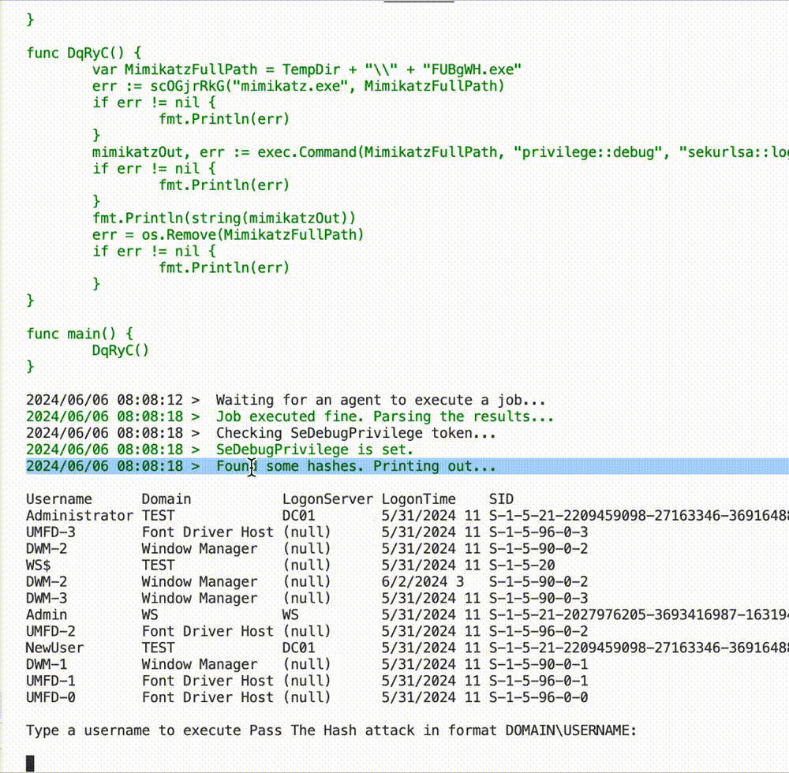

# Divine Dragon

Divine Dragon is my bachelor's degree project. It's more like a pet project, but I have tried to move it closer to the side where it becomes a real product. So, let's explore some features that the Divine Dragon is offering to you.

## Features

### Modular Architecture

Divine Dragon has a modular architecture (similar to [Metasploit](https://github.com/rapid7/metasploit-framework)). Implement new modules easily.

>Contributors are welcome!

### Command Line Interface

As many tools have it, I decided to implement it here too.

### Do enumeration and reconnaissance remotely.

The tool can perform the following basic steps in the enumeration process for pentesters:
* Enumeration of users via Kerberos service (borrowed some code from [kerbrute](https://github.com/ropnop/kerbrute)).
* Enumeration of users, groups, computers, DCs, OUs, built-in groups, and Kerberoasting and Asreproasting users via the LDAP service.
* Enumeration of SMB shares, including dumping all files from them if you have sufficient permissions.

### Exploit famous vulnerabilities remotely

The tool allows you to perform the following attacks:
* [ASREPRoasting](https://attack.mitre.org/techniques/T1558/004/)
* [Kerberoasting](https://attack.mitre.org/techniques/T1558/003/)
* [Password Spraying](https://attack.mitre.org/techniques/T1110/003/) via Kerberos and SMB

### Command & Control Server

Inside the tool, you can find the functionality to start the C2 server:
* The server is implemented as a simple web server with an API.
* The server will print your password to authenticate in its API (if you want that).
* The API implements role-based authorization.

### Throw exploits locally

The previous feature was the C2 server. As you can assume, there's also an implant. That's basically it. You have my implant, and I call it "agent". An agent is a payload that you can generate inside the CLI of the dragon. The agent is naked for now. It means that it has no evasion, no obfuscation, just the simple logic of the "agent". The agent talks to the C2 and asks it about new jobs. If it finds something in the list of available jobs, it will try to execute it if there is some payload available for the job, of course.

List of available payloads to execute through the agent:
* Enumeration via PowerShell script in the payload that uses [PowerView.ps1](https://github.com/PowerShellMafia/PowerSploit/blob/master/Recon/PowerView.ps1).
* Exploit for lateral movement/privesc: [Pass-the-Hash](https://attack.mitre.org/techniques/T1075/), [Pass-the-Ticket](https://attack.mitre.org/techniques/T1550/003/).
* Post-exploitation moment like [DCSync](https://attack.mitre.org/techniques/T1003/006/) attack.

All of the payloads described above are created through a basic "payload generator" module.

# Details of implementation

## Command Line Interface

General commands:
- `list modules` - to see the list of implemented or active modules.
- `show info <module>` - to see information about a specific module.
- `use <module>` - to choose a module.
- `sessions` - to check the sessions of the active agents.
- `jobs <agent-uuid>` - to check the jobs of a specific agent.
- `logs <agent-uuid>` - to check the logs of a specific agent.
- `exit`

Module commands:
- `info` - to see information about the chosen module.
- `show options` - to see the available options for the chosen module.
- `set <OPTION> <VALUE>` - to set a value to the module.
- `run` - to execute.
- `back` - to return to general commands.

## C2 server

C2 server implemented as an `HTTP` server with `REST API`. Currently, certificates for TLS server authentication are generated as self-signed.

The REST API has two roles implemented:
- `Agent` (like an implant, agent, or beacon)
- `Operator` (like a Red Team Operator)

Both roles will obtain a `Json-Web-Token (JWT)` after connecting to C2. Each of the generated tokens is signed with a very large secret. These JWT tokens are active for about 3 hours for each role. It is allowed to refresh the JWT token in 6 hours.

To start a C2, use the `c2` module as shown below:

### The agent role has the following API routes:
- `/connect` - a route to register a new agent and connect it to C2.
- `/agent/jobs` - a route to check all jobs of the specific agent.
- `/agent/jobs/:job-uuid/payload/` - a route for the agent to take a payload for a specific job with UUID.
- `/agent/jobs/update` - a route to update the status of the job.
- `/agent/logs/add` - a route to add logs with information about how the job goes.

The operator role has the following API routes:
- `/login` - a route to register a new operator and login at the same time. For now, it is what it is.
- `/operator/agents/` - a route to check all active agents.
- `/operator/agents/:agent-uuid/jobs` - a route to check the jobs of a specific agent.
- `/operator/agents:agent-uuid/jobs/:job-uuid/status` - a route to get the status of a specific job for a specific agent.
- `/operator/agents/:agent-uuid/logs` - a route to get all logs about the jobs of the specific agent.

### General Route
- `/helpers/:job-uuid/:helper-filename` - a route to download some helpers for payloads like Mimikatz, PowerView, etc.

## Agent

Agent is just a small program that will execute whatever it receives from the C2.
At the start of the process with the agent binary, it will gather the hostname and username and generate a unique UUID for the agent. After that, it will register with this information on C2.

The agent doesn't implement living-off-the-land techniques. It's more like a proof-of-concept or an example-like program in Go for the purposes of a pentest. So, each payload that you want it to execute will touch the filesystem.

To generate an agent, you have to use a special module called `payload_generator/agent`. More about it will be below.

## C2 and agent communication

The next scheme will summarize the above:

## Payload Generator

The payload generator is a module of the Divine Dragon. It has two main functionalities:
- Generate a stager (the agent above). `payload_generator/agent` module in CLI.
- Generate a payload for the stager. `payload_generator/shell` or any of `local_<whatever>/<whatever>` modules.

For example, to generate a new agent payload, use the `payload_generator/agent` module as below:

## Payload execution through the agent

Let's see a scheme that will explain how the Divine Dragon runs exploits locally through the agent:

As you can see, it's all about different executables, which, as I said before, will touch the filesystem.

The Divine Dragon will use module `payload_generator/stage_two` which is hidden for users in CLI. It will use it to generate all payloads for the agent and supply them to C2.

A little demonstration is below.

Part 1:

Part 2:
